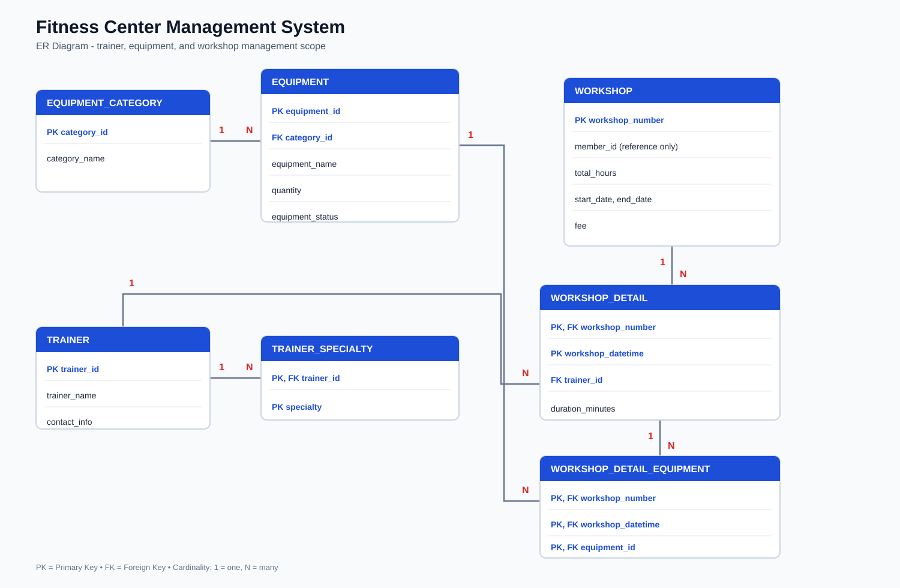
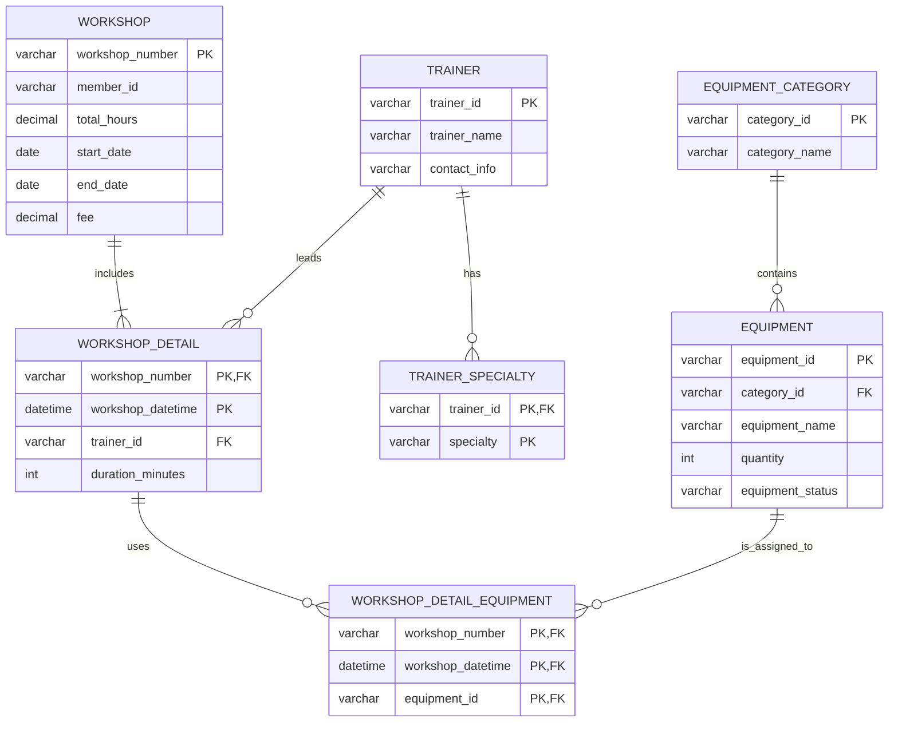

# Fitness Center Management System

This is my individual part of a group database-design project from class. The original class report is not included because it contains other group members' information. This repository only shows the part I worked on: trainers, equipment, equipment categories, workshop sessions, and workshop equipment usage.

## My Contribution

I designed the logical ER diagram, relational schema, data dictionary, and sample reports for trainer, trainer specialty, equipment, equipment category, workshop detail, and workshop-equipment usage tables.

## Database Design

This diagram is generated from the current `schema.sql`, so its table names and key relationships match the implementation in this repository.

### Entity Relationship Diagram for This Repository

## Features

- Tracks trainers, contact information, and multiple specialties.
- Manages equipment, categories, quantities, and availability status.
- Records equipment assigned to individual workshop sessions.
- Includes reporting queries for trainer profiles, equipment availability, inventory summaries, and maintenance needs.

## Repository Contents

| File | Description |
| --- | --- |
| `schema.sql` | Creates the MySQL 8.0+ database schema. |
| `seed_data.sql` | Inserts fictional sample data for demonstration. |
| `queries.sql` | Contains example reporting and analysis queries. |

## Tech Stack

MySQL 8.0+, SQL, Relational Database Design, ER Diagram, Primary Keys, Foreign Keys, JOIN, Aggregation

## How to Run

1. Open MySQL Workbench or another MySQL 8.0+ client.
2. Run `schema.sql`.
3. Run `seed_data.sql`.
4. Run `queries.sql` to view the example reports.

## Note

This repository is based on a group project, but it only contains my own database-design scope. All names, emails, IDs, and records in `seed_data.sql` are fictional examples. The `member_id` field is only a workshop reference because the full member-management module was outside my part. No class report, classmate information, student IDs, or real fitness-center data are included here.

## License

This repository uses the MIT License. You can use or adapt the SQL and schema as a learning example, but please keep the copyright and license notice.
